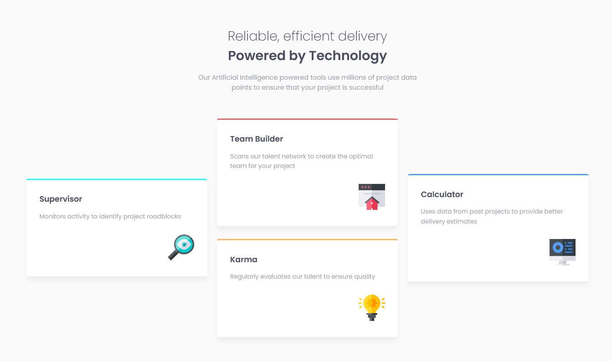

# Frontend Mentor - Four card feature section solution

This is a solution to the [Four card feature section challenge on Frontend Mentor](https://www.frontendmentor.io/challenges/four-card-feature-section-weK1eFYK). Frontend Mentor challenges help you improve your coding skills by building realistic projects.

## Table of contents

-   [Overview](#overview)
    -   [Screenshot](#screenshot)
    -   [Links](#links)
-   [My process](#my-process)
    -   [Built with](#built-with)
    -   [What I learned](#what-i-learned)
    -   [Continued development](#continued-development)
    -   [Useful resources](#useful-resources)

## Overview

### Screenshot



### Links

-   Solution URL: [Mr Coder youtube](https://www.youtube.com/watch?v=wxwsEZxa1AI&t=1070s)
-   Live Site URL: [Github Pages](https://tlbtrung-222.github.io/four-card-feature-section/)

## My process

### Built with

-   CSS custom properties
-   Grid and Flexbox

### What I learned

-   Align grid items in cross-axis :

```css
.grid-item1 {
    align-self: center;
}
```

### Continued development

-   Grid properties
